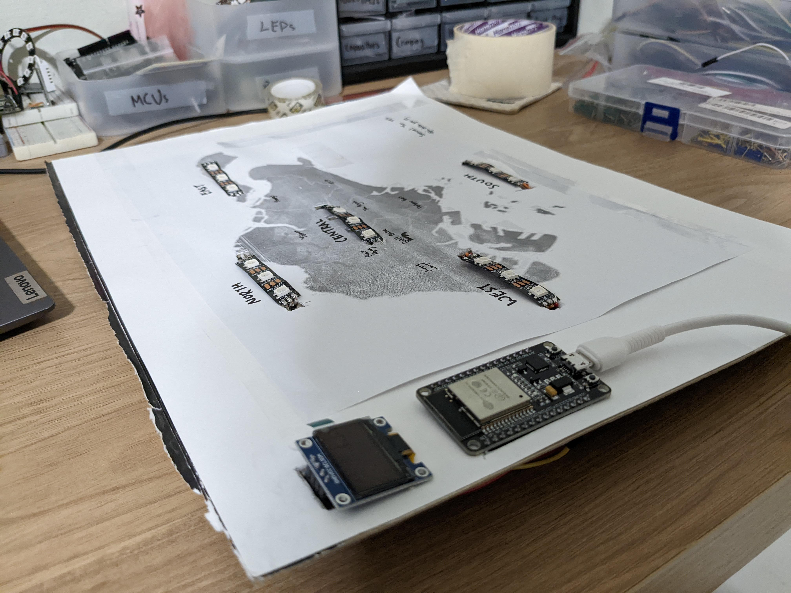

# ESP32WeatherStation

This project uses the NEA Weather Forecast API provided by api.data.gov.sg to visualize the weather forecast for the next 24 hours. Open Weather Map is also used to check the temperature, which is displayed on an OLED. Both APIs are updated every 30mins.

WS2812B LEDs are used to visualize the weather through the changing of colours.

# Updates

## Async OTA implemented
Go to http://IP_ADDRESS/update

File >> Save, Sketch >> Export Compiled Binary

Credits to https://randomnerdtutorials.com/esp32-ota-over-the-air-arduino/

